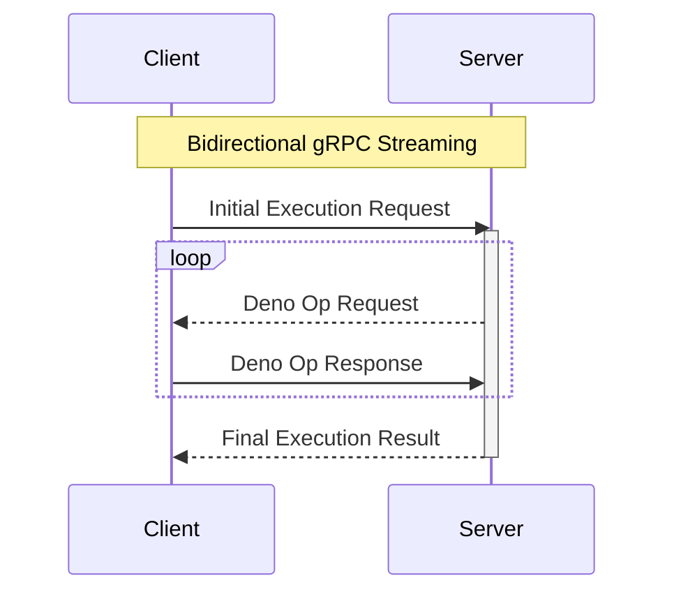

# lit_actions

`lit_actions` runs JavaScript code in a sandboxed Deno environment. It provides a gRPC API over a Unix socket (the server side) that is used by `lit_node`, which implements the client.



## Crates overview

- `snapshot` - Creates a V8 snapshot from the Deno runtime
- `ext` - Our Deno extension that implements Lit Actions
- `grpc` - Protobuf definitions and gRPC glue code
- `server` - gRPC server that runs JS code using Deno + Lit Actions
- `cli` - `lit_actions` tool built on top of `server`
- `tests` - Integration tests

## Local testing

Start the server from the command line:

```
> cargo run
```

Use [grpcurl](https://github.com/fullstorydev/grpcurl) to send commands to the server:

```
> grpcurl -unix -plaintext -authority dummy -d @ /tmp/lit_actions.sock com.litprotocol.actions.Action.ExecuteJs
{"execute": {"code": "console.log(2024)"}}

{
  "print": {
    "message": "2024\n"
  }
}

{"print":{}}

{
  "result": {
    "success": true
  }
}
```

```
❯ grpcurl -unix -plaintext -authority dummy -d '{"execute": {"code": "while (true) {}", "timeout": 1000}}' /tmp/lit_actions.sock com.litprotocol.actions.Action.ExecuteJs
ERROR:
  Code: DeadlineExceeded
  Message: Your function exceeded the maximum runtime of 1000ms and was terminated.
```

Adding headers:

```
❯ grpcurl -unix -plaintext -authority dummy -H "x-request-id: 1234" -d @ /tmp/lit_actions.sock com.litprotocol.actions.Action.ExecuteJs
```

Server reflection:

```
> grpcurl -unix -plaintext -authority dummy /tmp/lit_actions.sock list

> grpcurl -unix -plaintext -authority dummy /tmp/lit_actions.sock describe com.litprotocol.actions.Action
```

## Adding a new Deno op

These are the steps to implement a new `Hello` op as an example:

1. Update protobuf definitions to add new request and response messages

```diff
--- rust/lit-actions/grpc/schema/lit_actions.proto
+++ rust/lit-actions/grpc/schema/lit_actions.proto
@@ -24,6 +24,7 @@ message ExecuteJsRequest {
     ClaimKeyIdentifierResponse claim_key_identifier = 14;
     CallContractResponse call_contract = 15;
     CallChildResponse call_child = 16;
+    HelloResponse hello = 17;
   }

   message ExecutionRequest {
@@ -90,6 +91,10 @@ message ExecuteJsRequest {
   message CallChildResponse {
     string response = 1;
   }
+
+  message HelloResponse {
+    string response = 1;
+  }
 }

 message ExecuteJsResponse {
@@ -110,6 +115,7 @@ message ExecuteJsResponse {
     ClaimKeyIdentifierRequest claim_key_identifier = 14;
     CallContractRequest call_contract = 15;
     CallChildRequest call_child = 16;
+    HelloRequest hello = 17;
   }

   message ExecutionResult {
@@ -192,4 +198,8 @@ message ExecuteJsResponse {
     string ipfs_id = 1;
     bytes params = 2;  // serde_json::Value
   }
+
+  message HelloRequest {
+    string name = 1;
+  }
 }
```

2. Declare the op in Rust using its prefix

```diff
--- rust/lit-actions/grpc/proto.rs
+++ rust/lit-actions/grpc/proto.rs
@@ -80,6 +80,7 @@ decl_op!(CallContract);
 decl_op!(CheckConditions);
 decl_op!(ClaimKeyIdentifier);
 decl_op!(GetLatestNonce);
+decl_op!(Hello);
 decl_op!(IncrementFetchCount);
 decl_op!(PkpPermissionsGetPermitted);
 decl_op!(PkpPermissionsGetPermittedAuthMethodScopes);
```

3. Generate Rust code via `cargo build` and then format the proto file with `clang-format --Werror --style="{BasedOnStyle: Google, ColumnLimit: 120}" -i proto/*.proto`

4. Implement op logic using `remote_op!` or `remote_op_async!`

(see Deno's [op2 docs](https://github.com/denoland/deno_core/tree/main/ops/op2#readme) for JS <-> Rust type conversions)

```diff
--- rust/lit-actions/ext/bindings.rs
+++ rust/lit-actions/ext/bindings.rs
@@ -394,6 +394,17 @@ async fn op_call_child(
     )
 }

+#[instrument(skip_all, ret)]
+#[op2]
+#[string]
+fn op_hello(state: &mut OpState, #[string] name: String) -> Result<String> {
+    remote_op!(op_hello,
+        state,
+        HelloRequest { name },
+        UnionRequest::Hello(resp) => Ok(resp.response)
+    )
+}
+
 // Build a deno_core::Extension providing custom ops
 extension!(
     lit_actions,
@@ -405,6 +416,7 @@ extension!(
         op_check_conditions,
         op_claim_key_identifier,
         op_get_latest_nonce,
+        op_hello,
         op_increment_fetch_count,
         op_pkp_permissions_get_permitted_auth_method_scopes,
         op_pkp_permissions_get_permitted,
```

5. Add the op to the JavaScript Lit SDK

```diff
--- rust/lit-actions/ext/js/02_litActionsSDK.js
+++ rust/lit-actions/ext/js/02_litActionsSDK.js
@@ -245,6 +245,10 @@ function claimKey({ keyId }) {
   return ops.op_claim_key_identifier(keyId);
 }

+function hello({ name }) {
+  return ops.op_hello(name);
+}
+
 globalThis.LitActions = {
   isPermittedAction,
   isPermittedAddress,
@@ -268,5 +272,6 @@ globalThis.LitActions = {
   uint8arrayToString,
   uint8arrayFromString,
   aesDecrypt,
+  hello,
 };
 Object.freeze(LitActions);
```

6. Write a mock test to check that everything is wired up correctly, and run it with `cargo test`

```diff
--- rust/lit-actions/tests/it.rs
+++ rust/lit-actions/tests/it.rs
@@ -144,6 +144,10 @@ impl TestClient {
                 self.messages.put(req);
                 self.messages.take::<CallChildResponse>().into()
             }
+            UnionResponse::Hello(req) => {
+                self.messages.put(req);
+                self.messages.take::<HelloResponse>().into()
+            }
             UnionResponse::Result(_) => unreachable!(), // handled in main loop
         })
     }
@@ -1076,3 +1080,31 @@ async fn deno_version() {
     assert_eq!(client.received::<PrintRequest>().message, "undefined\n");
     assert!(client.received::<ExecutionResult>().success);
 }
+
+#[tokio::test]
+async fn hello() {
+    let socket = temp_file::empty();
+    start_test_server(socket.path());
+    let mut client = TestClient::new(socket.path());
+
+    let code = indoc! {r#"
+        const response = LitActions.hello({name: "Eric"})
+        LitActions.setResponse({response})
+    "#};
+
+    client
+        .respond_with(HelloResponse {
+            response: "Hello Eric".to_string(),
+        })
+        .respond_with(SetResponseResponse {})
+        .execute_js(code)
+        .await
+        .unwrap();
+
+    assert_eq!(client.received::<HelloRequest>().name, "Eric");
+    assert_eq!(
+        client.received::<SetResponseRequest>().response,
+        "Hello Eric"
+    );
+    assert!(client.received::<ExecutionResult>().success);
+}
```

7. Implement and test the real op in `lit_node`

```diff
--- rust/lit-node/src/functions/action_client.rs
+++ rust/lit-node/src/functions/action_client.rs
@@ -502,6 +502,13 @@ impl Client {
                 }
                 .into()
             }
+            UnionResponse::Hello(HelloRequest { name }) => {
+                // Greet the person
+                HelloResponse {
+                    response: format!("Hello {name}"),
+                }
+                .into()
+            }
             UnionResponse::Result(_) => unreachable!(), // handled in main loop
         })
     }
@@ -883,4 +890,23 @@ mod tests {
             "Your function exceeded the maximum memory of 100 MB and was terminated."
         );
     }
+
+    #[tokio::test]
+    async fn hello() {
+        let socket = temp_file::empty();
+        start_test_server(socket.path());
+        let mut client = ClientBuilder::default()
+            .socket_path(socket.path())
+            .build()
+            .unwrap();
+
+        let code = indoc! {r#"
+            const response = LitActions.hello({name: "Eric"})
+            LitActions.setResponse({response})
+        "#};
+
+        let res = client.execute_js(code).await.unwrap();
+
+        assert_eq!(res.response, "Hello Eric");
+    }
 }
```

## Tracing with Jaeger

See <https://www.notion.so/litprotocol/Tracing-with-Jaeger-973d3cf1a1ad49df9781d0e9b9d08152>

## Upgrading Deno

Do the following to upgrade Deno to a new version:

1. Find out the versions of the crates `deno_runtime` and `deno_core` by looking at the `Cargo.toml` file of the Deno version you want to upgrade to, e.g. <https://github.com/denoland/deno/blob/v1.43/Cargo.toml>
2. Modify [Cargo.toml](Cargo.toml) to use the new Deno crates
3. Update any patches in [Cargo.toml](Cargo.toml), e.g. for `deno_core`
4. Make sure `cargo build` works and `cargo test` passes all tests here and in `lit_node`
5. Commit the changes

## API docs

To regenerate the Lit Actions API docs:

```
npm install
make docs   # or: npm run docs
```
